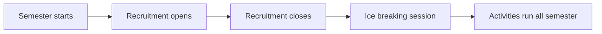

 

 
 

 

## About us

The COMSATS Software Engineering Society is a student society at COMSATS University Islamabad for people who want to learn, build and grow in software engineering.

We are a registered society of the university, approved by the Department of Computer Science, and part of the SE domain of the COMSATS Tech Society (CTS). The society is run by students, and every semester a new batch of executives takes charge.

## What we do

<table>
  <tr>
    <td width="33%" valign="top"><b>Ice breaking</b> Meet people and settle into the society</td>
    <td width="33%" valign="top"><b>Academic sessions</b> Study support and concept sessions</td>
    <td width="33%" valign="top"><b>Interview preparation</b> Get ready for technical interviews</td>
  </tr>
  <tr>
    <td valign="top"><b>Workshops</b> Hands on learning by building</td>
    <td valign="top"><b>Seminars</b> Talks on software and the industry</td>
    <td valign="top"><b>Networking</b> Connect with seniors and professionals</td>
  </tr>
  <tr>
    <td valign="top"><b>Entertainment</b> Games, fun and time to unwind</td>
    <td valign="top"><b>Hackathons</b> Build with a team against the clock</td>
    <td valign="top"><b>Tech team sessions</b> Skill sessions run by our tech team</td>
  </tr>
</table>

## Join us

<table>
  <tr>
    <td width="50%" valign="top">
      <b>General membership</b> 
      Open to all students of COMSATS University Islamabad.
    </td>
    <td width="50%" valign="top">
      <b>Executive membership</b> 
      For students from the 2nd to the 7th semester who want to help run the society.
    </td>
  </tr>
</table>

Recruitment runs at the start of every semester and closes before the ice breaking session.

Follow us on [Instagram](https://instagram.com/cses.isb) and [LinkedIn](https://www.linkedin.com/company/comsats-software-engineering-society/) so you do not miss the next drive. The full details live on our [website](https://cses.is-cool.dev).

## Our website

The team, the events and everything about the society live at [cses.is-cool.dev](https://cses.is-cool.dev). It is built with Astro and TypeScript and maintained by our tech team.

## Get in touch

Students, companies and media can reach the society through the Managing Director and the Co Managing Director, or write to [comsatsses@gmail.com](mailto:comsatsses@gmail.com). Sponsors and speakers are always welcome to reach out.

## Maintained by

**Syed Hassan Ali Bukhari**, Tech Lead, COMSATS Software Engineering Society

[GitHub](https://github.com/thehassanbukhari) | [Portfolio](https://hassanbukhari.is-a.dev/)

